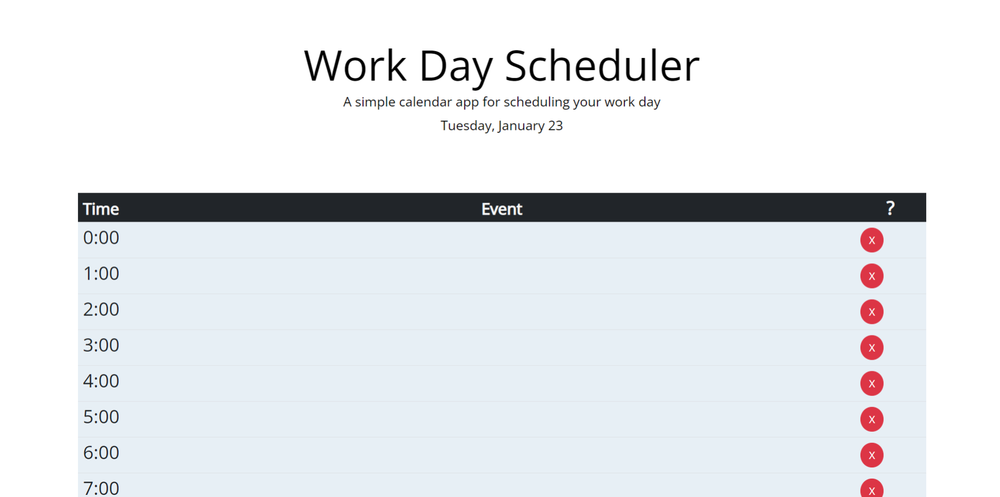

# Scheduler

This is a simple calendar application that allows users to manage their daily schedule. Users can add, update, and delete events for each hour of the day, providing an effective way to organize and plan their tasks.

## Overview

Time Blocks:

- Time blocks for standard business hours are presented as users scroll down the page.

- Each time block is color-coded to indicate whether it represents past, present, or future hours.

Event Input:

- Users can double click on a time block to enter and modify events.

Local Storage:

- Events are saved in local storage when the user clicks out of the block in blur.

Persistence:

- Events persist between page refreshes, providing a seamless user experience.

Current Day Display:

- The current day is prominently displayed at the top of the calendar when the user opens the planner.

## Resources

[Stackoverflow](https://stackoverflow.com/questions/5834983/javascript-confirm-cancel-button-not-stopping-javascript): For Confirm window not cancelling actions.

[Bootstrap](https://getbootstrap.com/): For Modals.

[Stackabuse](https://stackabuse.com/storing-data-in-the-browser-with-localstorage/): For issues with localstorage.

## Instructions

- Select one time slot and double click on it, then write the event. It will be automatically saved once you move out of the input field.

- To delete an event from a time slot, just use the delete button (X) on the right hand side of the calendar.

- The user can find instruction when clicking the question mark on the right end of the table head.

## Technologies Used

- [Day.js](https://day.js.org/docs/en/display/format): Used for handling date and time operations.

- [jQuery](https://jquery.com/): Used for dynamically updating HTML and CSS.

- [Bootstrap](https://getbootstrap.com/): Used for enhancing the overall design and layout.

## To Access

[View this Scheduler App](https://rober-web.github.io/Scheduler/)
